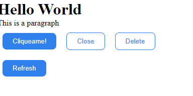

# Props

Las “props” son una forma abreviada de propiedades, y simplemente se refieren a los datos internos de un componente en React. Se escriben dentro de llamadas a componentes y se pasan a componentes. Dos cosas que vale la pena recordar sobre las props:

- En primer lugar, determinamos el valor de una “prop” y lo usamos como parte del plano antes de que se construya el componente.
- En segundo lugar, el valor de una prop nunca cambiará, es decir, las props son de solo lectura una vez que se pasan a los componentes.
- La forma de acceder a una prop es haciendo referencia a ella a través del parámetro que por convención llamamos “props”.


## Componente Button

Para entender las props, vamos a crear un componente llamado Button el cual estará en la carpeta `components` y tendrá la siguiente estructura:

```bash
kong-beer
├── public
│   ├── favicon.ico
│   └── index.html
├── src
│   ├── components
│   │   └── Button
│   │       ├── Button.css
│   │       └── Button.jsx
│   ├──...
```

El componente Button tendrá la siguiente estructura:

```jsx
import "./Button.css";

const Button = (props) => {
  return (
    <button className={`button button--${props.variant}`}>{props.title}</button>
  );
};


export default Button;
```

Además, tendrá un archivo CSS con el siguiente contenido:

```css
.button{
    border: none;
    outline: none;
    background: none;
    padding: 9px 20px;
    border-radius: 8px;
    margin: 10px;
}

.button--primary{
    background: #2f80ed;
    color: #fff;
}

.button--secondary{
    background: #fff;
    color: #2f80ed;
    border: 1px solid #2f80ed;
}
```

Ahora, en el componente `App` vamos a importar el componente `Button` y lo vamos a utilizar de la siguiente manera:

```jsx
import Button from './components/Button/Button'
import './App.css'

function App() {
  
  return (
    <div>
      <h1>Hello World</h1>
      <p>This is a paragraph</p>
      <Button title={'Cliqueame!'} variant={'primary'}/>
      <Button title={'Close'} variant={'secondary'} />
      <Button title={'Delete'} variant={'secondary'}/>
      <Button title={'Refresh'} variant={'primary'}/>
    </div>
  )
}

export default App
```

Como podemos ver, estamos pasando dos props al componente Button: `title` y `variant`. El valor de `title` es un string y el valor de `variant` es un string que puede ser `primary` o `secondary`.

Si abrimos la aplicación en el navegador, veremos lo siguiente:



