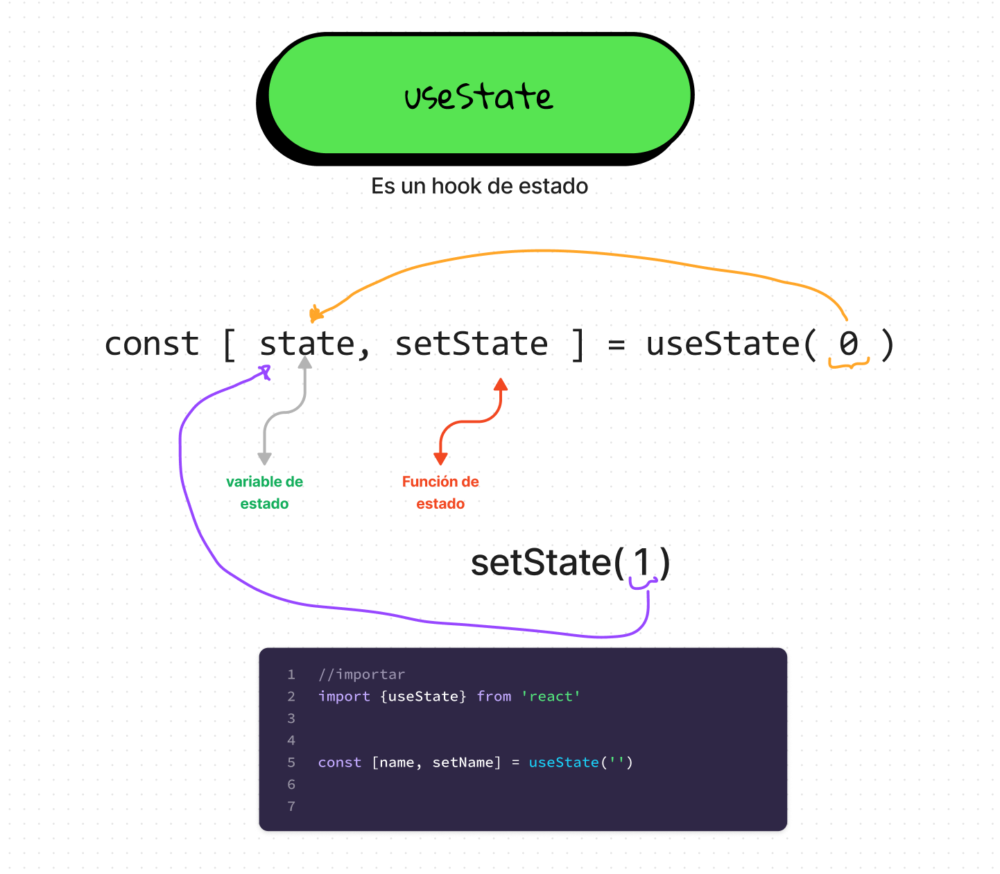

# States

Los estados en React JS son los datos que se van a utilizar en el componente. Estos datos pueden ser modificados por el usuario o por el mismo componente. Para poder utilizar los estados en un componente, se debe utilizar la función `useState` de React.

Los estados son fundamentales para que nuestra aplicación sea dinámica y reaccione a las acciones del usuario. Es decir, que si el estado cambiara, el componente se volvería a renderizar.

En esta clase lo que haremos será crear un componente llamado `ItemCount` que será un contador que tendrá un botón para sumar y otro para restar. Este componente tendrá un estado llamado `count` que será el que se modifique cada vez que se presione alguno de los botones.

## Componente ItemCount

Para crear el componente `ItemCount` vamos a crear una carpeta llamada `ItemCount` dentro de la carpeta `components` y dentro de esta carpeta vamos a crear dos archivos: `ItemCount.jsx` y `ItemCount.css`.

###### ItemCount.jsx
```jsx
import "./ItemCount.css";
import Button from "../Button/Button";

const ItemCount = () => {
  return (
    <div className="item-count">
      <div className="item-count__container">
        <Button fontSize={'1.2rem'} title={"-"} variant={"secondary"} />
        <div className="container__qty"> 0 </div>
        <Button fontSize={'1.2rem'} title={"+"} variant={"secondary"} />
      </div>
    </div>
  );
};

export default ItemCount;
```

###### ItemCount.css
```css
.item-count{

}

.item-count__container{
    display: flex;
    align-items: center;
}

.container__qty{
    display: flex;
    align-items: center;
    justify-content: center;
    width: 40px;
    height: 40px;
    background-color: var(--just-white);
    color: var(--primary-color);
    font-weight: 700;
    font-size: 1.2rem;
}
```

Como podemos ver, el componente `ItemCount` tiene dos botones y un número que se encuentra en el medio de los botones. Este número es el que se va a modificar cada vez que se presione alguno de los botones.

Para poder modificar este número, vamos a crear un estado llamado `count` que va a tener como valor inicial el número 0. Para crear este estado, vamos a utilizar la función `useState` de React.

###### ItemCount.jsx
```jsx
// importo el hook de estado llamado useState
import { useState } from "react";

import "./ItemCount.css";
import Button from "../Button/Button";


const ItemCount = () => {

    // creo el estado count y la función setCount que va a modificar el estado
    const [ count, setCount ] = useState(0)

  return (
    <div className="item-count">
      <div className="item-count__container">
        <Button fontSize={'1.2rem'} title={"-"} variant={"secondary"} />
        <div className="container__qty"> 0 </div>
        <Button fontSize={'1.2rem'} title={"+"} variant={"secondary"} />
      </div>
    </div>
  );
};

export default ItemCount;
```

Como podemos ver, la función `useState` recibe como parámetro el valor inicial del estado. En este caso, el valor inicial es 0.


## Hook de estado useState

### ¿Qué es un hook?

Un hook es una función que nos permite utilizar características de React sin la necesidad de escribir una clase. Los hooks son funciones que se pueden utilizar dentro de un componente de React y que nos permiten utilizar características como el estado, el ciclo de vida, etc.

### ¿Qué es el hook de estado useState?

El hook de estado `useState` nos permite crear un estado dentro de un componente de React. Este estado puede ser modificado por el usuario o por el mismo componente. Para utilizar el hook de estado `useState` debemos importarlo de la siguiente manera:

```jsx
import { useState } from "react";
```

### ¿Cómo se utiliza el hook de estado useState?

Para utilizar el hook de estado `useState` debemos crear una constante que va a ser el estado y una función que va a modificar el estado. Para crear el estado y la función que lo modifica, debemos utilizar la función `useState` de la siguiente manera:

```jsx
const [ count, setCount ] = useState(0)
```
* **count**: es el estado que vamos a crear. Se puede interpretar como una variable que va a tener un valor que puede ser modificado.
* **setCount**: es la función que va a modificar el estado. Se puede interpretar como una función que va a modificar el valor de la variable `count`. Cuando ejecutamos esta función, el valor de la variable `count` va a cambiar.
    - Ejemplo:
        ```jsx
        setCount(5)
        ```
        En este caso, el valor de la variable `count` va a ser 5.
* **useState**: es la función que nos permite crear el estado. Esta función recibe como parámetro el valor inicial del estado. En este caso, el valor inicial del estado es 0. 
    - Ejemplo:
        ```jsx
        useState(0)
        ```
        En este caso, el valor inicial del estado es 0.




## Modificar el estado

Para modificar el estado, debemos ejecutar la función que lo modifica. En este caso, la función que modifica el estado es `setCount`. Para ejecutar esta función, debemos utilizar un evento. En este caso, vamos a utilizar el evento `onClick` que se ejecuta cuando se hace click en un elemento.

```jsx
// Objetivo: crear el contador de productos

// importo el hook useState
import { useState } from "react";
import "./ItemCount.css";
import Button from "../Button/Button";

const ItemCount = () => {
  // creo el estado count y la función setCount que va a modificar el estado
  const [count, setCount] = useState(1);

  const increment = () => {
    setCount(count + 1); // cada vez que ejecute increment, el estado count va a incrementar en 1
  };

  const decrement = () => {
    setCount(count - 1); // cada vez que ejecute increment, el estado count va a incrementar en 1
  };

  return (
    <div className="item-count">
      <div className="item-count__container">
        <Button
          onClick={decrement}
          fontSize={"1.2rem"}
          title={"-"}
          variant={"secondary"}
        />
        <div className="container__qty">{count}</div>
        <Button
          onClick={increment}
          fontSize={"1.2rem"}
          title={"+"}
          variant={"secondary"}
        />
      </div>
    </div>
  );
};

export default ItemCount;
```

Como podemos ver, la función `increment` ejecuta la función `setCount` y le pasa como parámetro el valor del estado `count` más 1. Es decir, que cada vez que se ejecute la función `increment`, el estado `count` va a incrementar en 1.

Lo mismo sucede con la función `decrement`. Esta función ejecuta la función `setCount` y le pasa como parámetro el valor del estado `count` menos 1. Es decir, que cada vez que se ejecute la función `decrement`, el estado `count` va a decrementar en 1.


## Evitar que el estado sea menor a un valor inicial y al stock

```jsx
// Objetivo: crear el contador de productos

// importo el hook useState
import { useState } from "react";
import "./ItemCount.css";
import Button from "../Button/Button";

const ItemCount = ({initial, stock }) => {
  // creo el estado count y la función setCount que va a modificar el estado
  const [count, setCount] = useState(initial);

  const increment = () => {
    setCount(count + 1); // cada vez que ejecute increment, el estado count va a incrementar en 1
  };

  const decrement = () => {
    setCount(count - 1); // cada vez que ejecute increment, el estado count va a incrementar en 1
  };

  return (
    <div className="item-count">
      <div className="item-count__container">
        <Button
          onClick={decrement}
          fontSize={"1.2rem"}
          title={"-"}
          variant={"secondary"}
          disabled={count <= initial}
        />
        <div className="container__qty">{count}</div>
        <Button
          onClick={increment}
          fontSize={"1.2rem"}
          title={"+"}
          variant={"secondary"}
          disabled={count >= stock}
        />
      </div>
    </div>
  );
};

export default ItemCount;
```

Como podemos ver, en los botones se agregó un atributo llamado `disabled` que recibe un valor booleano. Si este valor es `true`, el botón se va a deshabilitar. Si este valor es `false`, el botón se va a habilitar.

Para esto agregamos dos condiciones en los botones. En el botón de restar, la condición es que el estado `count` sea menor o igual al valor inicial. En el botón de sumar, la condición es que el estado `count` sea mayor o igual al stock.

Además modificamos el componente Button de la siguiente manera:

```jsx
import "./Button.css";

const Button = (props) => {
  return (
    <button
      onClick={props.onClick}
      disabled={props.disabled}
      className={`button button--${props.variant}`}
      style={{ fontSize: props.fontSize ? props.fontSize : "1rem" }}
    >
      {props.title}
    </button>
  );
};

export default Button;
```

Con su respectivo css:

```css
button {
  border: none;
  background: none;
  font-family: var(--mulish-font);
  width: auto;
  padding: 12px 16px;
  line-height: 0.5rem;
}

.button--primary {
  background-color: var(--primary-color);
  border: none;
  font-family: var(--mulish-font);
  font-weight: 700;
  font-size: 1rem;
  cursor: pointer;
  transition: all 0.15s ease;
}

.button--primary:hover {
  transform: translate(-1px, -1px);
}
.button--primary:active {
  transform: translate(1px, 1px);
}

.button--secondary {
  border: 1px solid var(--border-color);
  color: var(--primary-color);
  font-family: var(--mulish-font);
  font-weight: 700;
  font-size: 1rem;
  cursor: pointer;
  transition: all 0.15s ease;
}

.button--secondary:hover {
  background-color: var(--primary-color);
  color: var(--just-white);
}

.button--secondary[disabled]{
    color: var(--border-color);
    cursor: inherit;
    background-color: transparent;
}
```

