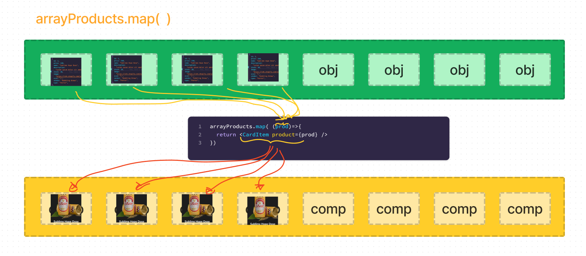

# Tipos de componentes

En React existen muchas formas de clasificar un componente, pero la más común es la que se basa en la forma en que se crean. En este sentido, existen dos tipos de componentes:

- **Componentes funcionales**: Son funciones de JavaScript que reciben un objeto con las propiedades del componente (props) y retornan un elemento de React. Estos componentes no tienen estado ni métodos de ciclo de vida.

- **Componentes de clase**: Son clases de JavaScript que extienden de la clase `React.Component`. Estos componentes tienen estado y métodos de ciclo de vida.

En 2023 el tipo de componente más usado es el funcional, pero en el pasado los componentes de clase eran la única forma de crear componentes en React. Por esta razón, es importante que conozcas ambos tipos de componentes.

Otra forma de clasificarlos es según su **responsabilidad**. En este sentido, existen dos tipos de componentes:

- **Componentes presentacionales**: Son componentes que se encargan de la interfaz de usuario. Estos componentes no tienen lógica de negocio ni estado. Reciben datos y funciones a través de las props y retornan elementos de React.

- **Componentes contenedores o inteligentes**: Son componentes que se encargan de la lógica de negocio. Estos componentes pueden tener estado y métodos de ciclo de vida. Además, pueden contener otros componentes, incluyendo a otros componentes contenedores.

## Componentes presentacionales

Los componentes presentacionales son funciones de JavaScript que reciben un objeto con las propiedades del componente (props) y retornan un elemento de React. Estos componentes pocas veces tienen estado o métodos de ciclo de vida.

### Creando un componente presentacional (CardItem)

Vamos a crear un componente llamado `CardItem` que se encargará de mostrar un item de una lista de productos. Este componente recibirá las siguientes props:

- **name**: Nombre del producto.
- **price**: Precio del producto.
- **description**: Descripción del producto.
- **thumbnail**: URL de la imagen del producto.
- **onAdd**: Función que se ejecutará cuando el usuario haga click en el botón de agregar al carrito.

En la carpeta `src/components` crea una carpeta `CardItem` y dentro un archivo llamado `CardItem.js` y escribe el siguiente código:

```jsx
import ItemCount from "../ItemCount/ItemCount";
import "./CardItem.css";

const CardItem = ({ product, onAdd }) => {
  return (
    <article className="card">
      
      <div className="card__info">
        <h3>{product.name}</h3>
        <p>${product.price}</p>
      </div>

      <ItemCount initial={1} stock={product.stock} />
    </article>
  );
};

export default CardItem;
```

En este componente estamos usando otro componente llamado `ItemCount` que se encargará de mostrar un contador de productos. Este componente lo creamos en la clase anterior.

Además, estamos usando un archivo CSS llamado `CardItem.css` que se encargará de darle estilos a nuestro componente.

```css
.card {
  display: flex;
  justify-content: center;
  align-items: center;
  flex-direction: column;
  gap: 1rem;
}

.card__image {
  width: 320px;
}

.card__info {
  text-align: center;
}
```

De acuerdo a lo que podemos observar en el componente `CardItem`, este componente no tiene estado ni métodos de ciclo de vida. Además, recibe datos y funciones a través de las props y retorna elementos de React.

A nuestro componete le falta la posibilidad de poder agregar un producto al carrito. Para esto, vamos a agregar un botón que se encargue de ejecutar la función `onAdd` que recibimos por props.

Ya que nuestro componente solo se limite a mostrar un estracto de html, podemos agregarle al componente `ItemCount` la responsabilidad de mostrar el botón de agregar al carrito. Para esto, vamos a modificar el componente `ItemCount` de la siguiente forma:

```jsx
// importo el hook useState
import { useState } from "react";
import "./ItemCount.css";
import Button from "../Button/Button";

const ItemCount = ({ initial, stock, onAdd }) => {
  // creo el estado count y la función setCount que va a modificar el estado
  const [count, setCount] = useState(initial);

  const increment = () => {
    setCount(count + 1); // cada vez que ejecute increment, el estado count va a incrementar en 1
  };

  const decrement = () => {
    setCount(count - 1); // cada vez que ejecute increment, el estado count va a incrementar en 1
  };

  return (
    <div className="item-count">
      <div className="item-count__container">
        <Button
          onClick={decrement}
          fontSize={"1.2rem"}
          title={"-"}
          variant={"secondary"}
          disabled={count <= initial}
        />
        <div className="container__qty">{count}</div>
        <Button
          onClick={increment}
          fontSize={"1.2rem"}
          title={"+"}
          variant={"secondary"}
          disabled={count >= stock}
        />
      </div>

      <Button onClick={onAdd} variant={"primary"} title={"Añadir al carrito"} />
    </div>
  );
};

export default ItemCount;
```

Como podemos observar, ahora el componente `ItemCount` recibe una nueva prop llamada `onAdd` que se encargará de ejecutar la función que recibe por props. Además, ahora el componente `ItemCount` se encarga de mostrar el botón de agregar al carrito.

Además, modificamos el archivo css del componente `ItemCount` para que el botón de agregar al carrito se muestre debajo del contador.

```css
.item-count {
  display: flex;
  flex-direction: column;
  justify-content: center;
  align-items: center;
  gap: 1rem;
}

.item-count__container {
  display: flex;
  align-items: center;
}

.container__qty {
  display: flex;
  align-items: center;
  justify-content: center;
  width: 40px;
  height: 34px;
  background-color: var(--just-white);
  color: var(--primary-color);
  font-weight: 700;
  font-size: 1.2rem;
}
```

Ahora, vamos a modificar el componente `CardItem` para que se encargue de ejecutar la función `onAdd` que recibe por props. Para esto, vamos a modificar el componente `CardItem` de la siguiente forma:

```jsx
import ItemCount from "../ItemCount/ItemCount";

const CardItem = ({ product, onAdd }) => {
  return (
    <article className="card">
      
      <div className="card__info">
        <h3>{product.name}</h3>
        <p>${product.price}</p>
      </div>

      <ItemCount initial={1} stock={product.stock} onAdd={onAdd} />
    </article>
  );
};
```

## Problemática de los componentes presentacionales

Los componentes presentacionales son muy útiles para separar la lógica de negocio de la interfaz de usuario. Sin embargo, en el caso de que tenga una colección de productos, tendríamos que repetir el componente `CardItem` por cada producto que tengamos. Esto no es muy eficiente, ya que estamos repitiendo código.

```jsx
      <CardItem product={productList[0]} onAdd={()=>{ alert('clic en onAdd') }} />
      <CardItem product={productList[1]} onAdd={()=>{ alert('clic en onAdd') }} />
      <CardItem product={productList[2]} onAdd={()=>{ alert('clic en onAdd') }} />
      <CardItem product={productList[3]} onAdd={()=>{ alert('clic en onAdd') }} />
      <CardItem product={productList[4]} onAdd={()=>{ alert('clic en onAdd') }} />
      <CardItem product={productList[5]} onAdd={()=>{ alert('clic en onAdd') }} />
      <CardItem product={productList[6]} onAdd={()=>{ alert('clic en onAdd') }} />
      <CardItem product={productList[7]} onAdd={()=>{ alert('clic en onAdd') }} />
      <CardItem product={productList[8]} onAdd={()=>{ alert('clic en onAdd') }} />
```

Para solucionar este problema, vamos a crear un componente que se encargue de mostrar una lista de productos. Este componente se encargará de iterar sobre la lista de productos y por cada producto va a renderizar el componente `CardItem`. Vamos a llamar a este componente `ItemList`.

### Creando un componente presentacional (ItemList)

En la carpeta `src/components` crea una carpeta `ItemList` y dentro un archivo llamado `ItemList.js` junto con su hoja de estilos `ItemList.css` y escribe el siguiente código:

**App.js**

```jsx
import "./App.css";
import { productList } from "./assets/products";
import ItemList from "./components/ItemList/ItemList";

function App() {
  return (
    <div>
      <ItemList products={productList} />
    </div>
  );
}

export default App;
```

**itemList.js**

```jsx
import "./ItemList.css";

// ItemList recibe por props un array de productos y renderiza un Item por cada producto

const ItemList = ({ products }) => {
  return <></>;
};

export default ItemList;
```

Para poder iterar los elementos de la lista de productos, vamos a usar el método `map` de los arrays. Este método recibe una función que se ejecutará por cada elemento del array. Esta función recibe como parámetro el elemento del array y retorna un elemento de React.

**Sintaxis del método map**

```jsx
array.map((elemento) => {
  return <Componente />;
});
```

**Representación gráfica del método map**


Ahora, vamos a modificar el componente `ItemList` para que itere sobre la lista de productos y por cada producto renderice el componente `CardItem`. Para esto, vamos a modificar el componente `ItemList` de la siguiente forma:

```jsx
import "./ItemList.css";
import CardItem from "../CardItem/CardItem";
// ItemList recibe por props un array de productos y renderiza un Item por cada producto

const ItemList = ({ products }) => {
  return (
    <div className="list-container">
      {products.map((prod) => (
        <CardItem
          key={prod.id}
          product={prod}
          onAdd={() => {
            alert("clic en onAdd");
          }}
        />
      ))}
    </div>
  );
};

export default ItemList;
```

Como podemos observar, ahora el componente `ItemList` itera sobre la lista de productos y por cada producto renderiza el componente `CardItem` como se puede ver en la imagen anterior.

Además, agregamos una prop llamada `key` que recibe el id del producto. Esta prop es necesaria para que React pueda identificar cada elemento de la lista de productos.

##### Más información sobre la prop key

La prop `key` es una propiedad especial que recibe un componente de React. Esta propiedad es necesaria para que React pueda identificar cada elemento de una lista. Esta propiedad debe ser única para cada elemento de la lista. En este caso, estamos usando el id del producto como valor de la prop `key`. 

En el caso de que no tengamos un id, podemos usar el índice del elemento como valor de la prop `key`. Sin embargo, no es recomendable usar el índice del elemento como valor de la prop `key`, ya que puede traer problemas de rendimiento.

Si no colocamos la prop `key` en un elemento de una lista, React nos va a mostrar un warning en la consola. Además, si no colocamos la prop `key` en un elemento de una lista, React no va a poder identificar cada elemento de la lista y esto puede traer problemas de rendimiento y comportamientos inesperados.

#### Estilos del componente ItemList

```css
.list-container{
    display: flex;
    flex-wrap: wrap;
    justify-content: center;
    align-items: center;
    gap: 30px;
    padding: 40px 24px;
}
```


