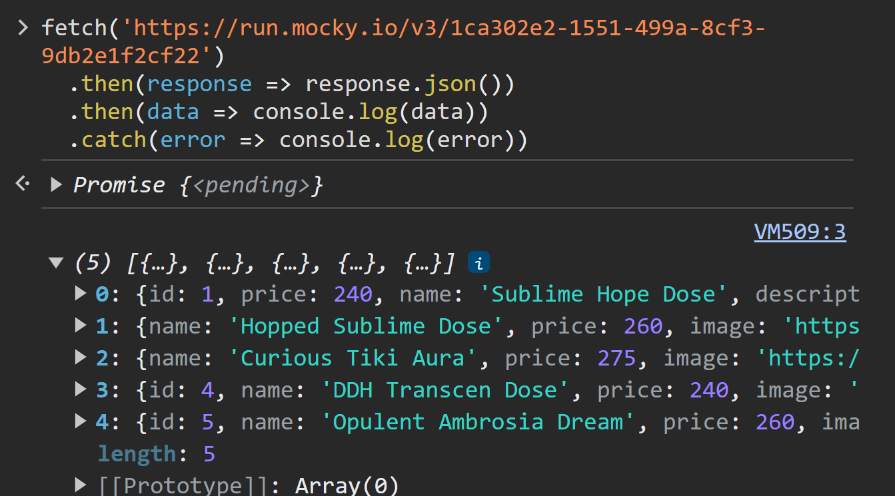

# Componentes inteligentes

## Introducción
Como hemos visto en clases anteriores, React está basado en componentes. Además, podemos clasificarlos en componentes inteligentes y componentes presentacionales. Los ***componentes inteligentes*** son aquellos que tienen lógica de negocio, mientras que los componentes presentacionales son aquellos que se encargan de mostrar la información. En este caso, nos enfocaremos en los componentes inteligentes.


## ¿Qué son los componentes inteligentes?

Son aquellos que se encargan de realizar las operaciones necesarias para que la aplicación funcione. Por ejemplo, si tenemos una aplicación que muestra una lista de tareas, los componentes inteligentes serán aquellos que se encarguen de agregar, eliminar y modificar las tareas. Por otro lado, los componentes presentacionales serán aquellos que se encarguen de mostrar la información. En este caso, serán aquellos que muestren la lista de tareas.


## Dinámica de los componentes inteligentes

En nuestro proyecto `Kong beer` tenemos dos componentes presentacionales que son `CardItem` y el `ItemList`.

* `CardItem`: Se encarga de mostrar la información de una cerveza en particular.
* `ItemList`: Se encarga de mostrar la lista de cervezas aplicando el método `map` sobre el arreglo de cervezas.

Sin embargo, deberíamos hacernos una pregunta: ***¿Quién se encarga de obtener la información de las cervezas?*** La respuesta es: los componentes inteligentes. En este caso, el componente inteligente será `ItemListContainer`. Este componente se encargará de obtener la información de las cervezas y luego se la pasará al componente `ItemList` para que este último se encargue de mostrar la información.


## Creando el componente inteligente

Para crear el componente inteligente, debemos crear un archivo llamado `ItemListContainer.jsx` dentro de la carpeta `components/ItemListContainer`. Luego, debemos importar el componente `ItemList` y crear el componente inteligente. El código de este componente es el siguiente:

```jsx
import ItemList from "../ItemList/ItemList"
import { productList } from "../../assets/products"

const ItemListContainer = () => {
  return (
    <div>
        <ItemList products={productList} />
    </div>
  )
}

export default ItemListContainer
```

Como se puede observar, ahora el componente `ItemListContainer` se encarga de obtener la información de las cervezas y luego se la pasa al componente `ItemList` a través de la propiedad `products`. Por otro lado, el componente `ItemList` se encarga de mostrar la información de las cervezas.

En esta instancia nuestro componente `App.jsx` debería verse de la siguiente manera:

```jsx
import './App.css'
import ItemListContainer from './components/ItemListContainer/ItemListContainer';

function App() {
  
  return (
    <div>
      <ItemListContainer />
    </div>
  )
}

export default App
```

## Obteniendo la información de las cervezas desde un servicio

En el ejemplo anterior, la información de las cervezas se encuentra en un archivo llamado `products.js` dentro de la carpeta `assets`. Sin embargo, en un proyecto real, la información de las cervezas se obtendría desde un servicio. Para esto vamos a simular que estamos obteniendo la información de las cervezas desde un servicio usando la siguiente URL: `https://run.mocky.io/v3/1ca302e2-1551-499a-8cf3-9db2e1f2cf22` y aplicando el método `fetch`, el cual devuelve una promesa.

### Repaso de promesas

Una promesa en un valor a futuro, es decir, es un valor que no conocemos en el presente, pero que sabemos que en algún momento lo tendremos. Por ejemplo, si compramos un boleto de lotería, no sabemos si nos ganaremos el premio, pero sabemos que existe la posibilidad de que nos ganemos el premio. En este caso, el premio sería el valor a futuro, con posibilidad de que se cumpla o no.

En el caso de las promesas en JavaScript, estas se pueden cumplir o no. Si se cumplen, se ejecuta la función `then`, mientras que si no se cumplen, se ejecuta la función `catch`. Por ejemplo, si tenemos una promesa que se cumple.

Vamos a aplicar un ejemplo de promesas usando fetch para obtener la información de las cervezas. 

```js

fetch('https://run.mocky.io/v3/1ca302e2-1551-499a-8cf3-9db2e1f2cf22')
  .then(response => response.json())
  .then(data => console.log(data))
  .catch(error => console.log(error))

``` 



Como se puede observar, la promesa se cumplió y se ejecutó la función `then`. En este caso, la función `then` recibe como parámetro la respuesta del servicio, la cual se debe convertir a JSON usando el método `json()`. Luego, se ejecuta la función `then` que recibe como parámetro los datos obtenidos del servicio. Finalmente, se ejecuta la función `catch` que recibe como parámetro el error que se produjo al obtener la información del servicio.


### Aplicando promesas en nuestro proyecto

Ya no vamos a traernos los productos desde el array productList sino que lo haremos a través de la URL mencionada anteriormente. Para eso eso vamos a implementar la función fetch en nuestro componente `ItemListContainer`. El código de este componente es el siguiente:

```jsx
import { useEffect, useState } from "react";
import ItemList from "../ItemList/ItemList";

const ItemListContainer = () => {
  /*lógica para obtener la información de los productos*/

  // 1. definir un estado para los productos
  const [products, setProducts] = useState([]);

  // 2. definir un useEffect para obtener los productos
  useEffect(() => {
    fetch("https://run.mocky.io/v3/1ca302e2-1551-499a-8cf3-9db2e1f2cf22")
      .then((response) => response.json())
      .then((data) => setProducts(data));
  }, []);

  return (
    <div>
      {products.length === 0 ? (
        <p>Cargando productos...</p>
      ) : (
        <ItemList products={products} />
      )}
    </div>
  );
};

export default ItemListContainer;

```

Como se puede observar, ahora el componente `ItemListContainer` se encarga de obtener la información de las cervezas a través de la función `fetch`. Luego, se ejecuta la función `then` que recibe como parámetro la respuesta del servicio, la cual se debe convertir a JSON usando el método `json()`. Finalmente, se ejecuta la función `then` que recibe como parámetro los datos obtenidos del servicio. En este caso, los datos obtenidos del servicio son los productos. Por otro lado, el componente `ItemList` se encarga de mostrar la información de las cervezas.


## UseEffect

El hook `useEffect` nos permite ejecutar código cuando se monta el componente, cuando se desmonta o cuando se actualiza. En este caso, vamos a usar el hook `useEffect` para ejecutar código cuando se monte el componente. Para esto, debemos importar el hook `useEffect` de la siguiente manera:

```jsx
import { useEffect } from "react";
```

Luego, debemos definir el hook `useEffect` de la siguiente manera:

El useEffect recibe dos parámetros: una función y un arreglo de dependencias. En este caso, la función que se ejecutará cuando se monte el componente es la siguiente:

```jsx
useEffect();
```

```jsx
useEffect( () => {} , [] );
```

```jsx
useEffect( () => {
  // código que se ejecutará cuando se monte el componente
} , [] );
```

Como se puede observar, la función que se ejecutará cuando se monte el componente se encuentra dentro del hook `useEffect`. Por otro lado, el arreglo de dependencias se encuentra vacío. Esto significa que la función se ejecutará cuando se monte el componente. Si el arreglo de dependencias no se encuentra vacío, la función se ejecutará cuando se monte el componente y cuando se actualice el componente. Por ejemplo, si tenemos el siguiente código:

```jsx
useEffect( () => {
  // código que se ejecutará cuando se monte el componente y cuando se actualice el componente
} , [dependencia] );
```


## Ciclos de vida de un componente

En la naturaleza los seres vivos tienen un ciclo de vida, por ejemplo, nacen, crecen, se reproducen y mueren. En el caso de los componentes, también tienen un ciclo de vida. En este caso, los componentes tienen tres estados: montado, actualizado y desmontado. En el caso del estado montado, el componente se monta cuando se renderiza por primera vez. En el caso del estado actualizado, el componente se actualiza cuando se actualiza el estado o las props. En el caso del estado desmontado, el componente se desmonta cuando se elimina del DOM.

El hook de react `useEffect` nos permite ejecutar código cuando el componente se monta, se actualiza o se desmonta.